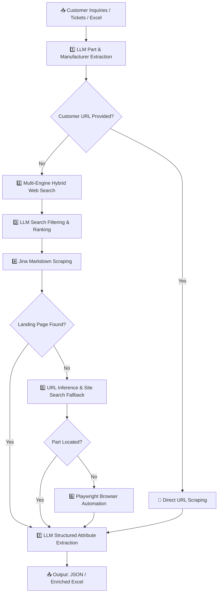

<div align="center">

# 🔬 Customer Cycle Graph (CCG)

**An AI-powered pipeline for automated electronic component discovery, lifecycle extraction, and datasheet retrieval.**

[](https://www.python.org/)
[](https://python.langchain.com/)
[](https://playwright.dev/)
[](https://docs.pydantic.dev/)
[](#running-tests)
[](LICENSE)

</div>

---

CCG processes unstructured customer inquiries, support tickets, and Excel spreadsheets — extracting manufacturer part numbers, searching manufacturer websites, scraping technical specifications, and returning structured component attributes, lifecycle data, and datasheets.

---

## ✨ Key Features

| Feature | Description |
| :--- | :--- |
| 🔍 **Hybrid Multi-Engine Search** | Auto-chains Google CSE → SerpAPI → Tavily → Firecrawl → DuckDuckGo → Jina with configurable priority |
| 🤖 **LLM Extraction & Ranking** | Structured Pydantic output with `json-repair` and tenacity retry logic for robust AI extraction |
| 🌐 **Jina Markdown Scraping** | Clean text extraction from manufacturer pages with rate limiting and anti-blocking heuristics |
| 🎭 **Playwright Browser Automation** | Full headless/headed browser control for JavaScript-heavy SPAs and complex search forms |
| 💾 **Stage-First Persistence** | Atomic JSON workspace state enables crash recovery and resuming without re-running prior stages |
| 📊 **Excel Bulk Enrichment** | Batch-process spreadsheets of part requests and export enriched results in one command |

---

## 🏗️ Pipeline Architecture

CCG uses a multi-tier, stage-first orchestration engine. Each part progresses through stages independently, with automatic fallback at each tier:



---

## 📁 Project Structure

```text
customer-cycle-graph/
├── src/
│   ├── integrations/              # External service clients
│   │   ├── browser_client.py     # Playwright browser controller & DOM snapshot
│   │   ├── llm_client.py         # LangChain + OpenAI-compatible LLM client (token tracking)
│   │   ├── scrape_client.py      # Jina Reader markdown scraper
│   │   └── search_client.py      # Hybrid search provider chain
│   │
│   ├── nodes/                    # Individual pipeline stage handlers
│   │   ├── extraction.py         # Part & manufacturer extraction from raw message
│   │   ├── search.py             # Search query generation
│   │   ├── filtering.py          # LLM candidate ranking & URL selection
│   │   ├── url_inference.py      # Manufacturer URL pattern inference
│   │   ├── site_search.py        # On-site search fallback
│   │   ├── browser_search.py     # Playwright-driven browser search
│   │   └── attribute_extraction.py # Structured attribute parsing from scraped content
│   │
│   └── pipeline/                 # Orchestration engine & state management
│       ├── config.py             # Centralized Pydantic settings + secret management
│       ├── orchestrator.py       # Multi-threaded stage-first orchestrator
│       ├── stages.py             # Stage batch execution logic
│       ├── router.py             # Stage transition routing rules
│       ├── prompts.py            # Structured LLM prompt templates
│       ├── state.py              # Data models (PartDetails, PipelineResult, PartStatus…)
│       └── state_io.py           # Atomic JSON state I/O and crash-recovery resume
│
├── scripts/                      # CLI entry points
│   ├── run_pipeline.py           # Single-message lookup (inline or file input)
│   ├── run_batch.py              # Multi-message JSON batch processor
│   └── run_bulk_excel.py         # Excel sheet reader and enricher
│
├── tests/                        # Automated unit tests
│   └── test_pipeline_models.py
│
├── .env.example                  # Configuration template (copy to .env)
├── .gitignore                    # Secrets, cache, and data exclusion rules
├── pytest.ini                    # Test runner configuration
├── requirements.txt              # Python dependencies
└── README.md
```

---

## 🚀 Quick Start

### Prerequisites
- **Python 3.10+**
- **Playwright Chromium** (installed after `pip install`)

### 1. Clone & Install

```bash
git clone https://github.com/your-username/customer-cycle-graph.git
cd customer-cycle-graph

# Create and activate a virtual environment
python -m venv .venv
.venv\Scripts\activate          # Windows
# source .venv/bin/activate     # Linux / macOS

# Install Python dependencies
pip install -r requirements.txt

# Install the Playwright browser binaries
playwright install chromium
```

### 2. Configure Environment

```bash
# Copy the configuration template
cp .env.example .env
```

Then open `.env` and fill in your credentials. At a minimum, you need:

```env
# Required
LLM_API_KEY=your_gemini_or_openai_api_key
JINA_API_KEY=your_jina_reader_api_key

# Optional: set a specific search provider, or leave 'auto' for hybrid fallback
SEARCH_PROVIDER=auto
```

> [!TIP]
> You only need API keys for the services you intend to use. The `auto` search provider will gracefully skip unconfigured providers.

---

## 💻 Usage

### Single Message Lookup

Run on an inline message:
```bash
python scripts/run_pipeline.py --message "Need lifecycle and datasheet for B22090025.60 from Vogt AG"
```

Run from a text file:
```bash
python scripts/run_pipeline.py --message-file ticket.txt
```

Run from a structured JSON file:
```bash
python scripts/run_pipeline.py --message-json ticket.json
```

**Exit codes:**
| Code | Meaning |
| :---: | :--- |
| `0` | All parts resolved successfully |
| `1` | Pipeline ran, but one or more parts failed |
| `2` | Pipeline could not start (bad config or input) |

---

### Batch Processing

Process a JSON dictionary of customer messages:
```bash
python scripts/run_batch.py --input-json inquiries.json --output-dir batch_results/
```

**Input format** (`inquiries.json`):
```json
{
  "ticket_001": "Please add part B22090025.60 by Vogt AG Verbindungstechnik",
  "ticket_002": "Lifecycle needed for FVD16H0474M22 from KYOCERA AVX"
}
```

---

### Bulk Excel Enrichment

Enrich a spreadsheet of part requests in one command:
```bash
python scripts/run_bulk_excel.py --input-file parts_list.xlsx --output-file parts_enriched.xlsx
```

---

## ⚙️ Configuration Reference

| Variable | Default | Description |
| :--- | :---: | :--- |
| `LLM_API_KEY` | _(required)_ | API key for your LLM provider (Gemini, OpenAI, or compatible) |
| `LLM_BASE_URL` | Gemini endpoint | Base URL for the OpenAI-compatible LLM endpoint |
| `LLM_MODEL_NAME` | `gemini-3.1-flash-lite` | Model identifier string |
| `LLM_MIN_INTERVAL_SECONDS` | `4.0` | Rate-limit throttle between successive LLM calls |
| `JINA_API_KEY` | _(required)_ | Bearer token for [Jina Reader](https://jina.ai/reader) API |
| `SEARCH_PROVIDER` | `auto` | `auto` or one of: `google_cse` `serp` `firecrawl` `tavily` `duckduckgo` `jina` |
| `ENABLE_SITE_SEARCH` | `true` | Fallback to on-site search on manufacturer domains |
| `ENABLE_SERIES_FALLBACK` | `true` | Search by part series when exact part is not found |
| `BROWSER_HEADLESS` | `true` | Run Playwright in headless (invisible) mode |
| `PIPELINE_TIER` | `auto` | Restrict to a single tier or `auto` to run all |
| `PIPELINE_WORKSPACE_PERSISTENT` | `false` | Keep per-message state files on disk for debugging and resume |
| `PIPELINE_MAX_WORKERS` | `4` | Thread pool concurrency for search and filter stages |

---

## 🧪 Running Tests

```bash
python -m pytest
```

Tests are located in `tests/` and cover core data models, Pydantic settings, and state persistence. The test runner is pre-configured in `pytest.ini` to automatically resolve `src/` imports.

---

## 📄 License

This project is licensed under the **MIT License** — see the [LICENSE](LICENSE) file for details.
